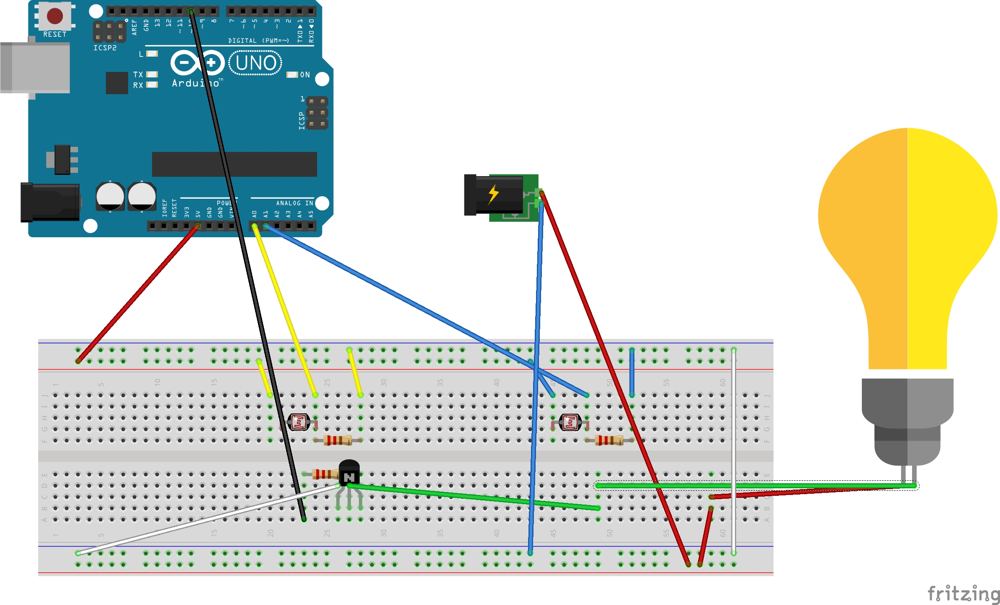

# Die helligkeitsgesteuerte Glühlampe
## Links

1. [Stundenprotokolle](https://github.com/philipp-arvid/philipp-arvid/blob/main/README.md)
2. [Einleitung](#Einleitung)
3. [Entwicklung des Projekts](#Entwicklung)
4. [Fazit](#Fazit)

<h1>1. Einleitung</h1> <a name="Einleitung"></a>

<h3>1.1 Das Team</h3>

Als Team haben sich Arvid Späth und Philipp Rinne zusammengeschlossen. Dies haben wir aufgrund vorheriger erfolgreicher Team-/Gruppenarbeiten gemacht. Außerdem waren wir beide sehr interessiert an Informatik und waren uns einig, dass wir viel Arbeit in das Projekt stecken wollen. Des Weiteren waren wir uns einig, dass wir ein Physical-Computing Projekt durchführen wollen. Also haben alle Vorstellungen zueinander gepasst und wir haben unser Projekt zusammen gestartet

 <h3>1.2 Der Arduino</h3>

Das Projekt "Helligkeitsgesteuerte Glühlampe" ist wie schon gesagt ein Physical-Computing Projekt.
Dies ist, unserer Meinung nach, besonders spannend, weil man die Software und Hardware kombiniert. Wir hatten jeder besonderse Interesse in einem Gebiet. 
Arvid interessiert besonders die Software und Philipp die Hardware. 
Dies passte gut zusammen, da wir beide uns besonders in unserem Bereich informierten und dann dem anderen jeweils die Ausführungen und den Aufbau erklären konnten.
Dies klappte sehr gut, weil wir den anderen Bereich, welcher dann vom Partner erklärt wurde, deutlich schneller verstanden. 
Besonders gereizt hat uns am Arduino, dass man die Theorie sozusagen mit der Praxis verbinden kann.
Also kann man seine Idee auch in der Realität umsetzen und diese kann eventuell auch in der Zukunft genutzt werden. 
Darüber haben wir uns im Fazit noch genauer Gedanken gemacht.

<h3>1.3 Genutzte Programme</h3>

Arduino App

Die Arduino-App ist natürlich die Grundlage unseres Projekts. Über diese haben wir unser Projekt gesteuert. Wir haben mit einem Arduino UNO gearbeitet.
Über die Aruino-App haben wir den Arduino gesteuert, welcher dann durch die Anweisungen die Helligkeit der Glühbirne steuert.
Für dies Programm haben uns am Anfang Videos geholfen. Am Ende war es aber besonders die Website der App, welche uns geholfen hat. 
Bei dieser gab es die allgemeinen Erklärungen, welche wir dann auf unser Projekt gut übertragen konnten

Github

Github wurde als programm für die Stundenprotokolle und Projektseite genutzt. 
Dies war sehr passend, weil Github ein Dienst zurVersionsverwaltung zur Software-Entwicklu8ng ist. 
Also Konnte man hier sehr gut das Projekt dokumentieren, da man gut Bilder und auch den Code vom Arduino einfügen kann.

Fritzing

<h1>Entwicklung des Projekts</h1> <a name="Entwicklung"></a>

<h3>2.1 Vorgehen </h3>

Am Anfang hat Herr Buhl uns  gesagt, dass wir die Grundlagen des Arduinos kennenlernen sollen. 
Also haben wir mit einfach ganz einfachen Code eine LED zum Leuchten gebracht.
Danach haben wir sie zum Blinken genbracht und daraufhin haben wir mehrere  LEDs eingebaut. 
Also haben wir erst die einfachsten Grundlagen gelernt und sie dann in das Projekt eingebaut. Am Anfang haben wir es dann natürlich weiterentwickelt.
Dieses Vorgehen haben wir als sehr gut erachtet und somit bei den weiteren Versuchen auch umgesetzt. Dies gilt für die Photodiode und auch die Glühlampe. 
Also haben wir  die Photodiode erst Werte aufnehmen lassen und gesehen. Ab dann wussten wir, wie sie funktioniert und haben sie mit der LED kombiniert. 
Die Glühlampe haben wir erst ohne Arduino angemacht, um die Grundlagen wie Stromkreis, usw. wieder aufzufrischen.
Dann haben wir die Glühlampe mit dem Arduino gesteuert und zuletzt dann mit den Photodioden kombiniert.
Außerdem hatten wir eine sehr gute Teamarbeit aufgrund der unterschiedlich stärkeren Interessen. 
Da wir aber auch am anderen Thema interessiert waren und die vorherigen Schritte auch erklärt bekommen haben, 
konnten wir bei Problemen dem anderen sehr effektiv helfen. Da es immer mal Probleme gab, haben wir uns beide mit beiden Themen viel beschäftigt und sie verstanden.
Am Anfang haben wir viel versucht mit Videos zu lernen und de Sachen zu verstehen.
Mit der Zeit haben wir aber gemerkt, dass wir uns schon so gut auskennen, dass wir die meisten Fehler oder auch einige Pläne durch logisches Denken umsetzen können.
Außerdem haben wir mehr auf der Arduino-Website gelesen. Denn sobald es spezieller wird, gibt es weniger verständliche Videos. 
Also haben wir am Ende unser Projekt durch nachdenken über Fehler und die Arduino-Website beendet. Dies ging deutlich schneller und war erfolgreicher.


<h3> 2.2 Die Idee</h3>

Als Gruppe haben wir uns ja wie schon gesagt auf ein Projekt des Physical-Computings geeinigt.
Dann haben wir uns einige Projekte angeguckt und haben uns überlegt, dass wir auch etwas messen und steuern möchten.
Dabei haben wir uns überlegt, dass wir mit Licht arbeiten wollen, weil dies eine gute Herausforderung darstellt, weil es aufgrund der schnell wechselnden Helligkeit,
schwierig ist, die Helligkeit zu steuern. Dies hätte zu stark schwankenden Werten kommen können. Aber trotz der möglichen Probleme wollten wir das Projekt angehen.
Dies wollten wir auf einen Schuhkarton übertragen, weil wir nicht das Material haben, um das Projekt in einem Raum auszuführen. 
In den ersten beiden Einzelstunden und einer Doppelstunde haben wir uns überlegt, dass wir dieses Projekt entwickelt und uns überlegt, dass wir es umsetzen wollen.
Dann haben wir das Projekt gestartet. Der Ablauf und die Entwicklungen sind dann in unseren Stundenprotokollen sichtbar.

<h3> 2.3 Softwaretechnische Umsetzung </h3>
 Die Aufgabe der Software ist es, die gemessenen Daten der Photodioden zu kombinieren und dann die Glühlampe in Abhängigkeit dieser Daten zu steuern. Dabei übernimmt offensichtlich der Arduino diese Aufgabe. 
 
 
<details>
	<summary>Auschnitt des Codes</summary>
	
```c
int licht;
int licht2;
	
	
void setup() {
	
	  Serial.begin(9600);
}
	
void loop() {

  licht= analogRead(0);
  licht2= analogRead(1);
  delay(20);

  Serial.println(licht + licht2);

}	
	
```
	
</details>
 

<li>Der Ausschnitt zeigt das Erfassen der Lichtintensitäten durch die beiden Photodioden. Am Anfang werden die zwei Variablen Licht und Licht2 eingeführt, die für das gemessene Licht der beiden eingebauten Photodioden stehen. Mit Serial.beginn(9600) wird generell der Serielle Monitor eingeführt, bei dem wir dann später unsere erfassten Lichtintensitäten ablesen können. Danach haben wir den beiden vorgestellten Variablen einen zugehörigen Input des Arduinos zugewiesen. Jetzt entsprechen die beiden Variablen jeweils den gemessenen Werten bei AnalogRead(0) und AnalogRead(1). Dazu haben wir noch eine Verzögerung der Messungen eingeführt, da dies später gegen Rückkopplungen hilft. Dies haben wir in Form der Delay-Funktion umgesetzt. Delay(20) heißt also, dass alle 20 Millisekunden gemessen wird. Als letztes haben wir die beiden Variablen dann zusammen addiert und beschreiben, dass diese vom Seriellen Monitor angezeigt werden sollen. Somit werden nur die beiden gemessen Lichtintensitäten der beiden Photodioden über einen seriellen Monitor mit einer Verzögerung von 20 Millisekunden angezeigt. </li>

 
<details>
	<summary>Auschnitt des Codes</summary>
	
```c
	
const int transistor = 10;
int aus;
	
void setup() {
	
  pinMode (10, OUTPUT);	
	
}
	
void loop() {
	
          aus = 255-map(licht + licht2, 150, 800, 0, 255);
	
          if (licht + licht2 > 800)
          aus=0;
          if (licht + licht2 < 150)
          aus=255;

  analogWrite(transistor, aus);
				   
}
				   
```
	
</details>
 
<li>In Diesem Ausschnitt haben wir die Verwertung der Lichtintensitäten zu einem Wert für die Glühlampe programmiert. Zu Beginn bezeichnen wir den Transistor mithilfe einer Variable und halten die Variable konstant am Wert 10 mit "const". Als nächstes legen wir fest, dass der 10. Pin als Output dient, denn dort ist nämlich der Transistor angeschlossen, was wir vorher mit der Variable Transistor entspricht 10 veranschaulicht haben. Als Nächstes haben wir den Operator "Map" verwendet mit dem wir die gemessenen Lichtintensitäten in einen Ausgangswert übersetzen. Dafür haben wir zuerst die Variable ausformuliert, die den Ausgangswert entspricht und daher aus dem Map-Operator hervorgeht. Bei der Map-Funktion setzt man Parameter für den zu "mappenden" Wert ein, also in diesem Fall 150 als niedrigster möglicher gemessener Wert und 800 als höchster. Vor diesen Parametern setzt man den Wert der "gemappt" werden soll, also in diesem Fall "Licht+Licht2". Als nächstes setzt man Werte für andere Parameter ein, auf die, die vorherig in den anderen Parametern, in Kontext gesetzten Messwerte, übersetzt werden sollen. Dort haben wir 0 und 255 eingesetzt, dies liegt daran, dass wir "Analogwrite" benutzen und diese Funktion einen Wert von 0 bis 255 ausgeben kann. Also werden nun die gemessenen Lichtintensitäten, die von 150 bis 800 reichen können auf Werte von 0 bis 255 "übersetzt". Dies bedeutet, dass wenn zum Beispiel der Wert 800 gemessen wird, also das Maximum des Parameters des gemessenen Lichts, dies entsprechend auch in das Maximum für die in zu übersetzenden Parameter übersetzt wird. In diesem Fall wäre das also so, dass dann ein Wert bei "AnalogWrite" für 255 ausgegeben wird. Genau so wird zum Beispiel, wenn genau die Mitte von den Parametern 150 bis 800 gemessen wird, auch genau die Hälfte von 255 als Wert für "AnalogWrite" ausgegeben.        </li>
	
	
<li>Nun haben wir nur noch das Problem, dass wir es zwar geschafft haben Werte von Lichtintensitäten auf einen Wert für den Ausgang, also für den Transistor zu übersetzen, aber, dass dies nicht die richtigen Werte sind. Denn wenn zum Beispiel eine hohe Lichtintensität gemessen wird, würde dies bedeuten, dass auch ein hoher Wert ausgegeben wird, da der Lichtintensitäten Wert ja zunächst nur auf die Parameter von 0 bis 255 übersetzt wird. Aber dies würde auch bedeuten, dass dadurch bei viel Licht, auch die Glühbirne stark leuchtet, da ja auch ein hoher Wert ausgegeben wird. Also haben wir uns überlegt, dass das Maximum von den Werten die "AnalogWrite" annehmen kann, also 255, von dem gemessen Wert, der durch die Map-Funktion übersetzt wurde, subtrahiert wird. Denn wir wollen ja genau das Gegenteil: Wenn es hell ist soll es Dunkel werden und nicht anders herum. Dies ist mit der eben beschreiben Rechnung gegeben, denn wenn nun wieder zum Beispiel ein Wert von 800 gemessen wird, wird er zunächst auf einen Wert von 255 übersetzt und dann wird das Maximum, also 255 mit dem gemessen Wert, also 255 subtrahiert. Dadurch erhalten wir bei einer hohen Intensität, eine Glühlampe, die aus ist.  </li>	

<li>Anschließend haben wir noch ein Maximum und ein Minimum mit dem If() Operatoren formuliert. Das dient dazu, dass die Glühlampe mit Sicherheit nicht mehr leuchtet, auch wenn die gemessenen Werte 800 übertreffen. Denn wenn man nicht diese Grenzen formulieren würde, dann ist die Glühlampe nämlich einfach mit einer relativ mittleren Leuchtkraft aktiv, wenn "licht+licht2" den Wert 800 übertreffen. Da dies nicht von uns gewollt ist, haben wir die Obergrenze und Untergrenze formuliert, bei der es genau anders herum ist: Wenn Lichtintensitäten von niedriger als 150 gemessen werden, dann leuchtet sie auch mittelstark. Man könnte vorschlagen, dass man einfach die Parameter bei der Map-Funktion nach oben und unten hin ausweitet, da man dann ja das Problem von zu hohen oder niedrigen Werten ja dann behoben hätte, doch dies macht das "mappen" insgesamt nur unpräziser und ungenauer, wenn die Parameter zu groß sind, und da diese Parameter auch nur selten über- oder unterschritten werden, haben wir uns für den Operator If() entschieden. Hierbei haben wir das so geschrieben, dass wenn ein Wert unter 150 gemessen wird, der Output einen Wert von 255 (also dem Maximum) ausgibt, und wenn ein Wert über 800 gemessen, ein Wert von 0 ausgesendet wird( also geht die Glühlampe aus). Als Allerletztes haben wir dann "AnalogWrite" an der Stelle 10 ( den Wert für die Variable des Transistors) einen Output, der den  Wert von der Variable "aus" annimmt, welcher durch die eben beschriebene Weise berechnet wird. Dadurch, dass das im Loop passiert, haben wir einen funktionstüchtigen Code geschrieben, der die Glühlampe abhängig von der Helligkeit steuer kann. </li>
	
<details>
	<summary>fertiger Code</summary>
	
```c
	
const int transistor = 10;
int aus;
int licht;
int licht2;

void setup() {
	
  pinMode (10, OUTPUT);
	
  Serial.begin(9600);
	
}
	
void loop() {

  licht= analogRead(0);
  licht2= analogRead(1);
  delay(20);

  Serial.println(licht + licht2);

         aus = 255-map(licht + licht2, 150, 800, 0, 255);
	
         if (licht + licht2 > 800)
         aus=0;
         if (licht + licht2 < 150)
         aus=255;

  analogWrite(transistor, aus);

			  			   
 }		   
			   
				   
```
	
</details>	
	
	
<h3> 2.4 Hadwaretechnische Umsetzung </h3>
	
	
	
Alle genutzten Teile konnten uns von der Schule gestellt werden.

- Das Herzstück des Projekts ist die Glühlampe. Diese ersetzte die zu Anfang genutzten LEDs, weil wir durch die Glühlampe mehr Licht bekamen, welches stärker reguliert werden kann und besser den Raum ausleuchtet.

- Damit diese 6V Glühlampe gesteuert werden kann, brauchten wir eine externe Energiequelle. Dafür haben wir ein externes Netzteil genutzt Dieses haben wir dann an die Steckdose angeschlossen und konnten es in den Stromkreis einbinden. Dadurch hat die Glühlampe genügend Strom bekommen um zu leuchten.

- Das, was die Glühlampe seuert

- Dazu haben wir dann die Photoioden genutzt, weil wir die herrschende Helligkeit messen mussten, um die Glühlampe zu regulieren. Die Photoiode ist die klassische Messung, welche man in Verbindung mit einem Arduino nutzt. Wir haben zwei Photoioden genutzt, welche an verschiedenen Stellen des Steckbretts angebracht sind, damit die durchschnittliche Helligkeit im Raum ermittelt werden kann.

- Ein weiterer Teil ist der Arduino. Dieser ist die Grundlage, weil jede Messung und Steuerung vom Arduino ausgeht. Dieser gibt die Messungen an den PC weiter, welche man auch im Video sehen kann.Daraufhin gibt der PC anweisungen an den Arduino, welcher diese dann weiterleitet oder auführt.

- Als "Raum" haben wir einen Schuhkarton gewählt, weil wir mit den vorhandenen Materialien nicht einen Raum ausstatten konnten, und diesen nicht zur verfügung hatten. Ein Schuhkarton war das perfekte Produkt, weil man ihn gut abdunkeln und wieder erhellen kann. Außerdem kann man durch das Loch die Kabel verbinden und hatte somit nicht immer einen Lichtschlitz im Deckel.
	
	
 
<h3> 2.5 Das Endprodukt </h3>
Youtube Link: https://youtu.be/EAZcYoLfER0

<h1>3. Fazit</h1> <a name="Fazit"></a>
 

Wir ziehen ein sehr positives Fazit, weil wir beide viel Spaß am Projekt hatten. Durch das beidseitige Interesse gab es auch immer eine sehr produktive Zusammenarbeit.
Mit dem Endprojekt sind beide sehr zufrieden. Wir konnten leider den Zielwert nicht umsetzen, aber mussten einsehen, dass dies bei der Arbeit mit Helligkeit sehr schwierig wäre. 
Zu Beginn war es eine sehr effektive gemeinsame Planung, welche wir dann mit der Zeit gut umsetzen konnten.
Aufgrund unserer guten Arbeit waren wir früher fertig und konnten unser Projekt auf Rat von Herrn Buhl noch durch eine Glühlampe verbessern.
Wir sind sehr froh die Idee jetzt in Wirklichkeit umgesetzt zu haben. Dies freut und fasziniert uns an dem Physical-Computing. 
Insgesamt haben wir nun gute Kenntnisse im Bereich des Arduinos. Dies gilt für die Software und die Hardware. 
Das Voranbringen des Projekts lief sehr gut, da wir beide einen großen Willen hatten.
Wir haben uns auch 2-mal am Wochenende zusammengesetzt und am Projekt weitergearbeitet. 
Auch wenn es manchmal längere Phasen ohne Erfolg gab überwog die Freude über das Lösen dieses Problems dann umso mehr.
Aufgrund der guten Zusammenarbeit, der Freude und des Erfolgs (welche auch durch die frühe Fertigstellung gezeigt wurde), 
haben wir uns entschieden auch im 2. Halbjahr wieder zusammenarbeiten. Ein gutes Klima in der Gruppe ist wichtig, da sonst keine effektive Zusammenarbeit stattfinden kann.
Da es bei speziell diesem Projekt keine großen Verbesserungen, welche auch für uns möglich sind, mehr gibt haben wir uns entschieden in eine ähnliche Richtung zu gehen.
Für unser nächstes Projekt arbeiten wir wieder, aufgrund des Interesses und der Vorkenntnisse, mit dem Physical-Computing. Einen genaueren Plan, für das kommende Projekt, gibt es in unserem Ausblick.

<h3> 3.1 Nutzung im Alltag </h3>

Wir haben uns ein Physical-Computing-Projekt ausgesucht, weil uns, wie schon gesagt, der Bezug zur Realität interessiert. 
Somit haben wir uns auch während der Projektentwicklung immer wieder überlegt, wofür man das Projekt im Alltag nutzen könnte.
Als erste Möglichkeit ist es ganz normal das Licht im Haus oder vor dem Haus somit zu regeln.
Dies würde dazu führen, dass das Licht nicht unnötig bei Helligkeit an ist, oder es halb dunkel ist. 
Wenn man den Strom direkt aus der Stromquelle schon steuert, ist dies auch deutlich umweltfreundlicher, da man nicht immer den ganzen Strom braucht.
Dies würde auch für einen selber zu einem Ersparnis werden, weil man weniger Strom bezahlt. 
Das gleiche gilt für Laternen in der Stadt. 
Auch im Auto könnte man dies einbauen, weil somit das Unfallrisiko gemindert wird, weil das Licht automatisch gesteuert wird und somit nicht vergessen wird anzumachen. 
Des Weiteren blendet es den entgegenkommenden und vor einem fahrenden Verkehr nicht, weil das Licht von dort such wahrgenommen wird und das eigene somit geschwächt wird.
Also kann man diese "Erfindung" in vielen und auch wichtigen Bereichen des Alltags nutzen. Es dient nicht nur dem Aussehen, wie am Haus, sondern auch der Sicherheit, wie im Auto.

<h3> 3.2 Ausblick </h3>

Für die Zukunft haben wir uns überlegt, dass wir weiter mit dem Arduino arbeiten wollen, weil wir jetzt schon ein gutes Grundwissen dazu haben. 
Wir wollen aber nicht mehr mit der Helligkeit, sondern mit der wärme arbeiten. 
Unser Ziel ist es nämlich, dass wir durch eine Glühlampe, welche wärme abgibt, die Temperatur im Raum steuern können. 
Also messen wir diesmal die Temperatur, statt die Helligkeit, um auch noch etwas neues zu dem bereits bekannten zu lernen. 
Bei diesem Projekt ist uns besonders wichtig, dass die Wärme auch wirklich gehalten oder hergestellt wird. Dies ist auch noch eine Veränderung, weil man mit der Helligkeit keinen genauen Wert erreichen kann.
