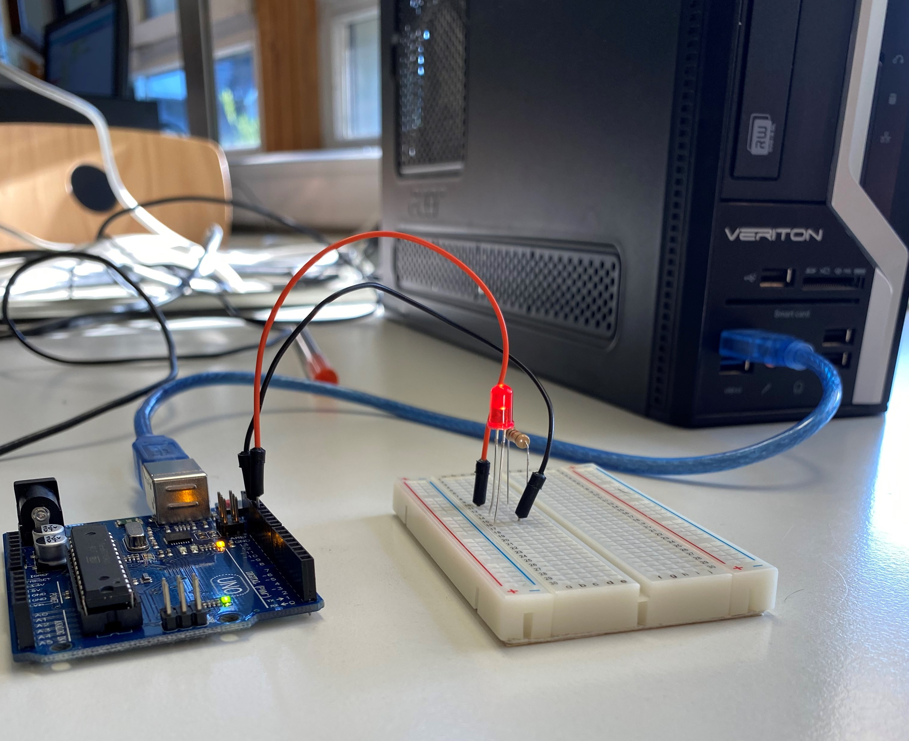
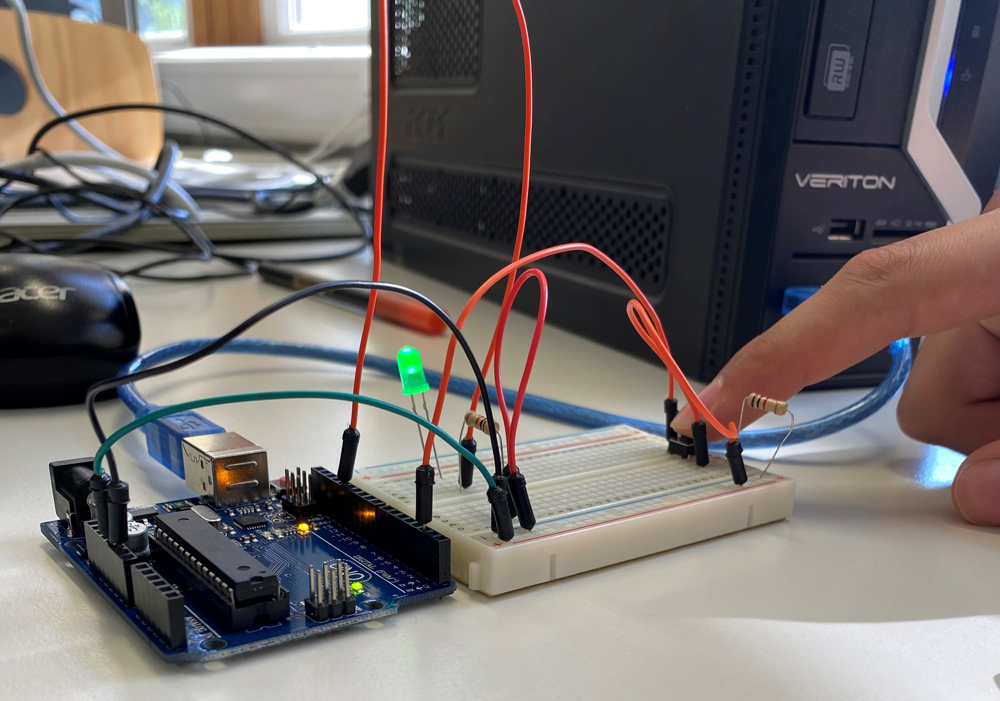
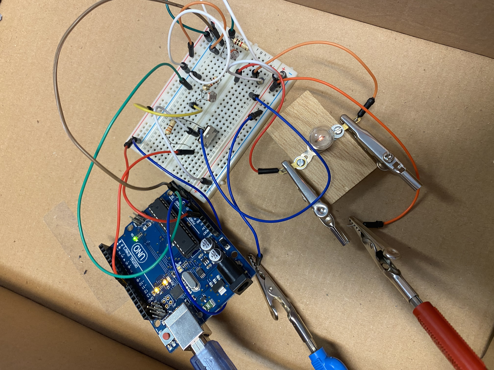

# Informatikprojekt: X

### Stundenprotokolle<a name="einf"></a>

</p>
</br>
</br>


## Stundenübersicht
<table align="center">
     
<tr>
    <td><a href=#eins>1.Stunde am 16.08.2022</a></td>
    <td><a href=#zwei>2.Stunde am 17.08.2022</a></td>
    <td><a href=#drei>3.Stunde am 23.08.2022</a></td>
    <td><a href=#vier>4.Stunde am 24.08.2022</a></td>
    <td><a href=#fünf>5.Stunde am 30.08.2022</a></td>
</tr>
<tr>
    <td><a href=#sechs>6.Stunde am 31.08.2022</a></td>
    <td><a href=#sieben>7.Stunde am 06.09.2022</a></td>
    <td><a href=#acht>8.Stunde am 07.09.2022</a></td>
    <td><a href=#neun>9.Stunde am 13.09.2022</a></td>
    <td><a href=#zehn>10.Stunde am 14.09.2022</a></td>

</tr>
<tr>
    <td><a href=#elf>11.Stunde am 27.09.2022</a></td>
    <td><a href=#zwölf>12.Stunde am 28.09.2022</a></td>
    <td><a href=#dreizehn>13.Stunde am 26.10.2022</a></td>
    <td><a href=#vierzehn>14.Stunde am 01.11.2022</a></td>
    <td><a href=#fünfzehn>15.Stunde am 02.11.2022</a></td>
     
 </tr>
 <tr>
    <td><a href=#sechzehn>16.Stunde am 08.11.2022</a></td>
    <td><a href=#siebzehn>17.Stunde am 09.11.2022</a></td>
    <td><a href=#achtzehn>18.Stunde am 15.11.2022</a></td>
    <td><a href=#neunzehn>19.Stunde am 16.11.2022</a></td>
    <td><a href=#zwanzig>20.Stunde am 22.11.2022</a></td>
      
 </tr>
 <tr>
    <td><a href=#einundzwanzig>21.Stunde am 23.11.2022</a></td>
    <td><a href=#zweiundzwanzig>22.Stunde am 29.11.2022</a></td> 
    <td><a href=#dreiundzwanzig>23.Stunde am 30.11.2022</a></td>  
    <td><a href=#vierundzwanzig>24.Stunde am 06.12.2022</a></td>
    <td><a href=#fünfundzwanzig>25.Stunde am 07.12.2022</a></td>
      
</tr>
<tr>
     
    <td><a href=#sechsundzwanzig>26.Stunde am 13.12.2022</a></td>
    <td><a href=#siebenundzwanzig>27.Stunde am 14.12.2022</a></td>
     <td></td>
</tr>
     
 </table>
  
 ### 1.Stunde vom 16.08.2022<a name="eins"></a> 
   
 In unserer ersten informatikstunde hat herr buhl uns unsere projektaufgabe vorgestellt, und github gezeigt. Wir haben einen Github Account angelegt und uns einige projekte von ehemaligen Schülern angesehen.Diese gingen in verschiedene richtungen und wir konnten uns auf github einen ersten überblick über 
 unsere optionen verschaffen. Wir haben noch überleht, ob wir ein Computerspiel programmieren wollen, oder vielleicht doch in Richutng physical Computing gehen wollen. 

 ### 2.Stunde vom 17.08.2022<a name="zwei"></a> 

In den heutigen Informatikstunden haben wir uns nochmal näher mit den früheren Projekten beschäftigt. 
Wir haben uns die verschiedenen Möglichkeiten alle ausführlich angeguckt und haben entschieden, dass wir etwas in Richtung Physical Computing machen wollen. 
Außerdem haben wir uns mit den verschiedenen Arduinos beschäftigt und überlegen uns nun welches Projekt genau wir machen wollen. 
Es gibt schon erste Ideen wie, dass man wenn ein Mensch im Raum ist die Lichthelligkeit kostant hält.
Die Helligkeit im raum soll gemessen werden und dann wird die Helligkeit einer Lampe gesteuert, sodass es im Raum immer gleich hell ist.
Bei dieser Idee wird die Anweisung durch Bewegungs und Lichtsensoren gesteuert.

 ### 3.Stunde vom 23.08.2022<a name="drei"></a>

Heute haben wir uns final entschieden das in der vorherigen Stunde geplante Projekt umzusetzten. Außerdem haben wir nach den benötigten Materialien recherchiert und 
haben uns diese rausgesucht. Wir brauchen ein Steckbrett, Kabel, eine LED, Wiederstände und eine Photodiode sowie das Herzstück, den Arduino, der die LED abhängig von der Lichtintensität steuern soll. Für den Arduino haben wir uns auf der Webiste zu den verschiednen Modellen informiert und haben herausgefunden, dass dies gut mit einem Arduino Uno funktioniert, der glücklicherweise auch im Inventar der Schule vorzufinden ist. Wir hoffen, dass es möglich ist, dass der Arduino die Messwerte der photodiode bekommt und diese in einen Stromstärke Wert für die LED übersetzen kann. Doch da wir noch keine Vorkenntnisse über die Funktion des Arduinos haben, werden wir erst recherchieren und kleine Experimente machen, um ein Basiswissen zu erschliessen. 


 ### 4.Stunde vom 24.08.2022<a name="vier"></a>


In der heutigen doppelstunde haben wir das erste Mal mit dem arduino experimentiert. wir haben zuerst eine LED zum blinken gebracht. Dies hat sofort geklappt. Als wir dies geschafft haben, bekamen wir die Aufgabe einen Schalter mit einzubauen. Bei dieser Aufgabe gab es deutlich mehr schwierigkeiten als bei der ersten Aufgabe. Am Ende haben wir auch dies geschafft. Wie man im Bild sieht, ist der Aufbau etwas komplizierter als bei der ersten Aufgabe. Durch diese Experimente haben wir erste Schritte mit dem Arduino gelernt und außerdem, wie man grundsätzlich in der Arduino-App programmiert.

<details>
    <summary>Bilder der ersten Versuche</summary>



     
</details>

 ### 5.Stunde vom 30.08.2022<a name="fünf"></a>

In der heutigen Stunde haben wir zuerst nach einem passendem weissen LED Strip recherchiert. Wir haben versucht einen 5V Strip zu finden, da wir dann keinen Mosfar benutzen müssten. Dananch haben wir wieder experimentiert und versucht mit einem fotosensor Licht zu messen und dies erflogreicht geschafft. Wir haben den Fotosensor über ein Steckbrett an den Arduino angeschlossen. Dann wurden die gemessenen Lichtintensitäten an den Computer weitergegeben, bei welchem wir sie durch den "serielle Monitor" ablesen konnten. Dann haben wir noch gesteuert, wie oft die Werte gemessen werden sollen, da sie sonst dauerhaft gemessen wwerden und dies bei unserem Projekt sehr wahrscheinlich zu Rückkopplungen führen würde.


 ### 6.Stunde vom 31.08.2022<a name="sechs"></a>

Zuerst haben wir den Aufbau aus der gestrigen Stunde wiederholt und dann haben wir uns weiter informiert und wollten dann den erflogreich verbundenen fotosensor mit einer LED verbinden. Unser Ziel war es, dass die LED leuchtet, wenn der Fotosensor ein niedrigen Wert misst, also wenn es dunkler wird und entsprechend bei einem hohen wert, also wenn es heller wird, aus geht. Also wird die Helligkeit der LED durch die Messwerte des Fotosensors gesteuert. Dies haben wir letztendlich auch geschafft. Zuerst haben wir dies mit "if" geschafft. Das heißt, wenn die Helligkeit beim fotonsensor einen gewissen Wert unterschreitet, geht die LED an. Dann haben wir uns über Arduino Map informiert und haben durch dies die Helligkeit gesteuert. Die Helligkeitswerte haben wir also in AnalogWrite werte übersetzt und "gemapt". Dadurch gab der Arduino dann eine bestimmte Voltzahl aus und die LED leuchtet verschieden Hell. Bei der Map Funktion werden die gemessen werte des Fotosensors in einen Wert "gemappt", ds besdeutet übersetzt: Bei Analogwrite, welches den analog Ausgang besxchreibt können die Werte einen wert von 0 bis 256 einnehmen. das  bedeutet, wenn eine niedrige Lichtintensität gemessen wird, gibt ddie mp funktion ein entrechennen hogehen Wert us. Also wenn eine niedrige Lichtintnesität gemessen wird, wird eine niedrige Zahl übersetzt. Damit dies den richtigen wert für unsere LED ausgiibt haben wir den wert der übersetzt wird mit 256 also den maximal wert formuliertt. So wird eine hohe Zahl beki einem niedrigen Lichtintensität ausgesendet und eine niedrige bei einer hohen Lichtintensität.  
<details>
    <summary>Video</summary>
youtube link: https://youtube.com/shorts/dSEDDhvoHi0
</details>

<details>
    <summary>Code</summary>   
     
```c
     
int licht;
int ledOut
int tmp;

void setup() {
  Serial.begin(9600);
  pinMode(11,OUTPUT);
}
void loop() {

  licht= analogRead(0);
  Serial.println(licht);

  tmp= map(licht, 300,700,0,255);
  ledOut = 255-tmp;
     
  analogWrite(11,ledOut);
     
  }
     
```

    
</details>
     


 ### 7.Stunde vom 06.09.2022<a name="sieben"></a>

Heute haben wir zunächst den aufbau der letzen Woche wieder aufgebaut und haben uns weitere Funktionen auf der Arduino website über den Arduino durchgelesen, um die Schwankungen zu minimieren. Die LED wird sehr hell bei niedrigen Lichtintensitäten und daraufhin wird wieder mehr Licht gemessen und die LED wird dunkler. Wir haben uins verschiedene Funktionen auf der Arduino website angeguckt, doch haben noch keine Lösung für das Problem in dieser Stunde gefunden. Wir haben uns außerdem noch überlegt, dass man möglicherweise in Zukunft einen Richtwert programmieren könnte, der immer als Ziel gilt, um die Schwankungen auch unter nderem zu minimieren. des Weiteren haben wir weitere zukunftspläne für unser Projekte aausgearbeitet und uns übelegt, dass man vielleicht mehrere LEDs und Photodioden einbauen könnte.

 ### 8.Stunde vom 07.09.2022<a name="acht"></a>

In dieser Doppelstunde haben wir einige funktionen versucht, doch leider hat es noch nicht geklappt, Wir haben unter anderem die == Funktion sowie die define() funktion. Des Weiteren haben wir nun andere Funktionen rausgesucht, die wir in der nächtsen Strunde probieren wrrden. Außerdem haben wir überlegt, wie wir die Schwankungen in der Helligkeit verringern können. Dadurch waren wir wieder auf der Seite des arduinos. DOrt haben wir 2 sachen probiert. Diese haben aber leidder noch nicht gelklappt

 ### 9.Stunde vom 13.09.2022<a name="neun"></a>

In dieser Stunde haben wir den Aubau mit dem Photosensor und der LED nochmals aufgebaut und anschliessend haben wir uns überlegt, dass man mit einer (if) funktion eine Helligkeit erhalten könnte, dass die Led durch die Messungen keine so großen Schwankungen hat. Aktuell passiert es nämlich immmernoch, dass es ganz dunkel ist und dann die LED genz hell wird. dadurch ist es zu hell und die LED wird wieder dunkler. Mit der (if) Funktion ist unser Ziel, dass der Strom, welcher zu der LED fließt nur ein bisschen in jeder Messung verändert wird.Da die Map Funmktion einen Wert von 0 bis 256 ausgibt, ist unsere Idee, dass wenn die gemessene lichtintensität einen gewissen wert über- oder unterschreitet, dann wird der Wert der Map funkition um 10 erhöht oder gesenkt. Wenn dies oft passiert ist die LED auch nach einer kurzen Zeit angepasst. Dies werden wir in der morgigen Doppelstunde programmieren und ausprobieren.

### 10.Stunde vom 14.09.2022<a name="zehn"></a>

Heute haben wir den ganzen Aufbau in den Schuhkarton gebaut, welches später unser "Zimmer" sein soll.In diesem Schuhkarton kann unser Aufbau dann immer beibehalten werden und wir können in den darauffolgenden Stunden sofort starten. Dies ist sehr nützlich, weil unser Aufbau mittlerweile sehr komplex ist und wir durch den erneuten Aufbau in jeder Stunde viel Zeit verlieren. Außerdem haben wir versucht den Mittelwert zwischen den beiden Fotoioden zu bilden. Dies haben wir mit einer for-Schleife probiert, was aber nicht funktioniert hat.
<details>
    <summary>video</summary>
   youtube link:  https://youtube.com/shorts/-gh2HerkUUg 
     
   </details>

### 11.Stunde vom 27.09.2022<a name="elf"></a>

In der heutigen Informatikstunfe haben wir weiter versucht herauszufinden, wie man einen Mittelwert bildet. Dies haben wir zuerst mit der Array- Funktion und dananch mit der Millis-Funktion versucht. Bei beiden Methoden sind wir allerdings gescheitert. Alle Funktionen sind sehtr komlex, obwohl wir nur zwei Werte haben.

### 12.Stunde vom 28.09.2022<a name="zwölf"></a>

Heutige haben wir wieder weiter recherchiert, wie man einen Mittelwert bilden. Die ganzen Funktionen aus dem Internet haben aber nicht geklappt und wir haben uns überlegt, dass wir einfach die beiden Werte der Fotoioden Addieren und die Werte der Map-Funktion auch verdoppeln. Somit haben wir unser langes Problem mit einer einfachen Idee gelöst. Dazu haben wir durch die If-Funktion bestimmt, dass die LEDs ausgehen, wenn es zu hell wird. Dies hat davor nicht funktiopniert, weil sie dann außerhalb der Map Funktion lagen und dann normal geleuchtet haben.

### 13.Stunde vom 26.10.2022<a name="dreizehn"></a>

Heute haben den Code wieder eingefügt und den Arduino angeschlossen. Daraufhin wurde uns ein Fehler beim kompillieren angezeigt. Daraufhin haben wir mehrere Zeilen geändert und sie teilweise kommentiert. Mit diesem simlen Code waren wir uns zu 100% sicher, dass kein Fehler mehr enthalten war. Als der Fehler daraufhin immernoch auftauchete haben wir Herrn Buhl um Hilfe gebeten. Nachdem wir dann alles kommentiert haben und der Fehler immernoch auftauchte, haben wir alles in einen neuen Sketch kopiert. Daraufhin hat der Code wieder funktioniert. Dann hatten wir unseren Aufbau vom Prinzip her mit Code fertig. Darauhin hat uns Herr Buhl vorgeschlagen eine Glühlampe anmstatt der LEDs, weil diese besser dimmbar sind. Dann haben wir uns mit der Glühlampe beshcäftigt und versucht, diese zum leuchten zu bringen. Dies hat aber nicht geklappt. Aufgrund der 6 Volt, die ide Glühlampe braucht und der nur vorhndenen 5 V des Arduinos muss man noch ein externes Netzteil und einen Transistor einfügen.

### 14.Stunde vom 01.11.2022<a name="vierzehn"></a>     
     
Heute ist die Stunde ausgefallen. Wir haben aber Zuhause recherchiert und über die Glühlampe infomiert. Somit können wir nächste Stunde einfacher starten, weil wir über Die Stromrichtung und den Aufbau mit dem Transistor schon bescheid wissen.

### 15.Stunde vom 03.11.2022<a name="fünfzehn"></a> 

Heute haben wir die Glühlampe einegbaut. Zuerst haben wir die Glühlampe in einem einfachen Aubau nur mit dem Arduino, dem Netzteil und einem Transitor aufgebaut und die Glühlampe zum Blinken gebracht. Dies haben wir, wie bei den LEDs gemacht, um den Grundaufbau zu verstehen. Dann haben wir das ganze mit dem Aufbau der Photoioden kombiniert und haben einen ganzen Aufbau mit Verbindung zwischen den Photoioden und der Glühlampe. Dadurch haben wir jetzt unseren endgültigen Aufbau fertig und müssen in der nächsten Stunde noch den Code abändern.

<details>
       <summary>bild</summary>
       
   
 </details> 

### 16.Stunde vom 08.11.2022<a name="sechzehn"></a>

Heute aben wir uns um den code gekümmert, also dass dieser auch mit der neuen Glühlampe funktioniert. Dies hat leider natürlicherweise nicht mehr mit dem alten Code geklappt und deshalb müssen wir einige dinge verändern. Leider haben wir es vorerst nicht geschafft eine ähnliche funktion wie mit dem LEDs hervorzubringen. Unser Problem ist, dass zwar Werte der Photodioden gemessen werden, die Glühlampe aber nicht reagiert. Woran das liegt, wissen wir nicht. Wir könnten uns vorstellen, dass es an unserem Umgang im Code mit dem Transistor liegt. Wir haben in der Stunde auch noch recherchiert, wie man dieses Problem lösen könnte. Wir befürchtem, das wir nicht mehr die map funktion benutzen können und anstelle uns pid widmen müssen. 

### 17.Stunde vom 09.11.2022<a name="siebzehn"></a>

In der heutigen Doppelstunde haben wir unser Projekt fertiggestellt. Wir haben die letzten Fehler behoben. Der erste Fehler war, dass die LED bei zu niedrigen Werten der Helligkeit nicht auf der maximalen Helligkeit ist, sondern manchmal ausgeht. Dann haben wir die If-Funktion genutzt und gesagt, dass die Glühlampe bei einem Wert unter dem Minimum der Map-Funktion die maximale Helligkeit hat. Das zweite und größte Fehler war, dass wir gesagt hatten, dass der Transistor den Ausgang 10 benutzt. Wir haben aber gesagt, dass dieser Variabel ist. Also kann sich der Ausgang verändern. Dies war natürlich falsch und wir haben es geändert, indem wir gesbgat haben, dass der Transistor feswt auf 10 bleibt. Dazu haben wir dann eine Variable genutzt, die den Ausgang 10 steuert. Durch dies in Kombination, geht der Strom immer zum Transistor, aber wird durch die Variable variiert. Dann schreibt man die Map-Funktion natürlich zur Variable und durch diese Veränderungen, ist die Map-Funktion auch wieder Problemlos nutzbar. Durch diese Veränderungen funktioniert unser Projekt jetzt auch mkit der Glühlampe.

<details>
       <summary>video</summary>
youtubelink:https://youtu.be/95P9wpTDUl0
     
 </details>     
 
 
<details>
       <summary>fertiger code</summary>
     
```c
const int transistor = 10;
int aus;
int licht;
int licht2;

void setup() {
  pinMode (10, OUTPUT);
  Serial.begin(9600);
}
void loop() {

  licht= analogRead(0);
  licht2= analogRead(1);
  delay(20);

  Serial.println(licht + licht2);

  aus = 255-map(licht + licht2, 150, 800, 0, 255);
 if (licht + licht2 > 800)
  aus=0;
  if (licht + licht2 < 150)
  aus=255;

  analogWrite(transistor, aus);
     
  }
     
```
     
 </details> 
     
### 18.Stunde vom 15.11.2022<a name="achtzehn"></a>
Heute haben wir ein Video von unserem erreichten Projekt gemacht und angefangen an unserer Projektseite zu arbeiten. Dafür haben wir uns eine Gliederung überlegt, die für uinser Projekt passend ist und einen Plan gemacht, wie wir die benötigten Texte aufteilen. Zudem haben wir festgestellt, dass wir ein schönes Layout für unseren Blog haben wollen und haben uns vorgenommen an diesem noch weiter zu arbeiten und die Texte auf Fehler zu korriegieren. 

### 19.Stunde vom 16.11.2022<a name="neunzehn"></a>
Auch Heute haben wir am Porjekt weitergeschrieben und weitere Fortschritte bei der Fertigstellung des Blogs und der Prjektseite gemacht.

### 20.Stunde vom 22.11.2022<a name="zwanzig"></a>
DIese Stunde ist leider entfallen und wir haben ein paar kleinere Veränderungen am Blog von Zuhause durchgeführt.

### 21.Stunde vom 23.11.2022<a name="einundzwanzig"></a>
Heute habem wir uns weiter GEdanken gemacht, wie man den Blog und die Projektseite moch anschaulicher machen könnte. Dafür haben wir bei einem blivk auf vorherige Projekte die Software Fritzing entdeckt. Dabei handelt es sich um ein Programm, bei welchem man (Schaltkreise) darstellen kann. Wir haben uns gedacht, dass wir auch im Anblick der Zeit dies noch sehr gut umsetztemn können, um unseren Aufbau noch besser zu zeigen. Außerdem können wir so vorherige kleinere Aufbauten im Laufe des Projekts so noch einmal visualisieren. Mit der Recherche über das Programm haben wir diese Stunde angefangen und auch arbeitsteilig weiter an der Projektseite gearbeitet. 

### 22.Stunde vom 29.11.2022<a name="zweiundzwanzig"></a>     
Diese Stunde ist leider entfallen und wir haben mal wieder ein wenig von Zuahsue aus an unseren Github Seiten weitergearbeitet.   
     
### 23.Stunde vom 30.11.2022<a name="dreiundzwanzig"></a>    
In dieser Stunde haben wir die Tabelle im Blog fertiggestellt, welches den Blog deutlich übersichtlicher und schöner macht.ANsosnten haben wir einfach Heute , wie zuvor.  
     
### 24.Stunde vom 06.12.2022<a name="vierundzwanzig"></a>      
Heute haben wir einerseits über Fritzing gelesen und ein Video geschaut und weiter am Blog und an der Projektseite gearbeitet. Auch haben wir nach der Schule die Fritzing Software heute schonmal heruntergeladne und die ersten einfachen Stromkreise dargestellt.  
     
### 25.Stunde vom 07.12.2022<a name="fünfundzwanzig"></a>      
Heute haben wir wieder weiter an der Projektseite und am Blog gearbeitet und haben uns auch schonmal überlegt, was wir im 2. Halbjahr machen wollen. Durch Gespräche mit Herr Buhl hatten wir schon eine Vorstellung: Wieder eine Glühlampe aber diemsal nicht mit dem Fokus auf die Helligkeit sondern auf die Temepratur. 

### 26.Stunde vom 13.12.2022<a name="sechsundzwanzig"></a> 

### 27.Stunde vom 14.12.2022<a name="siebenundzwanzig"></a> 
